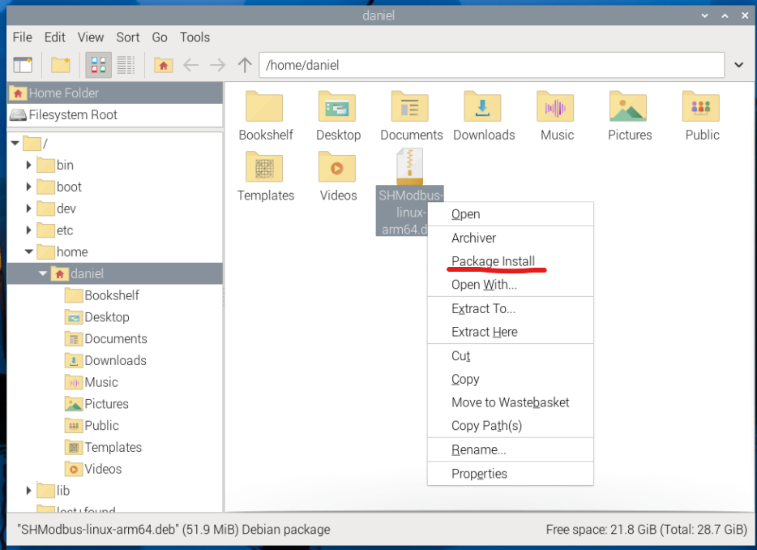
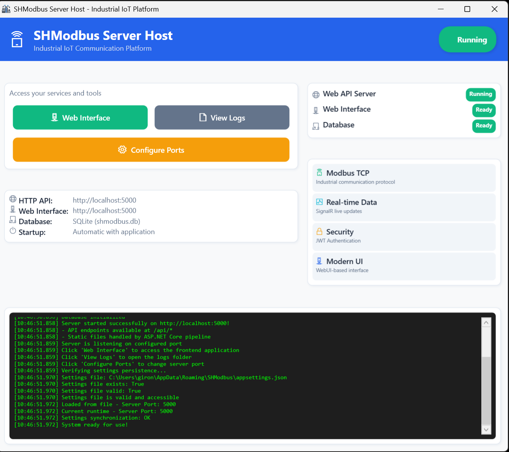
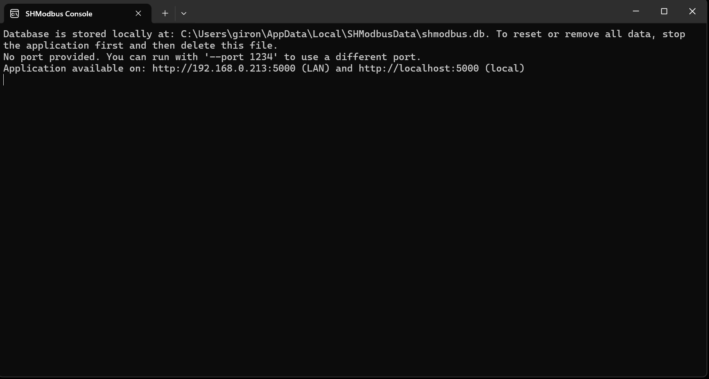
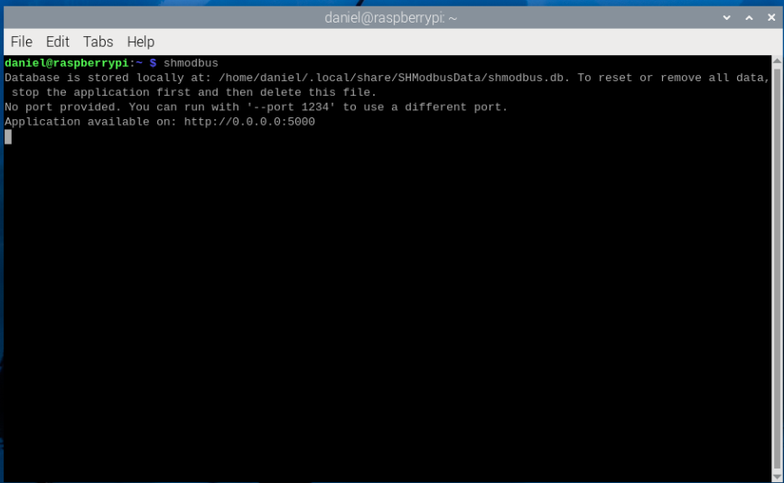
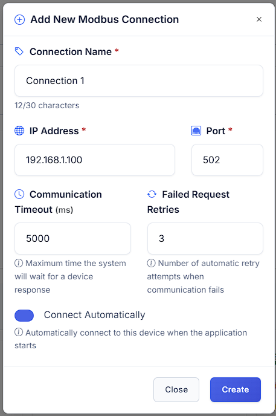
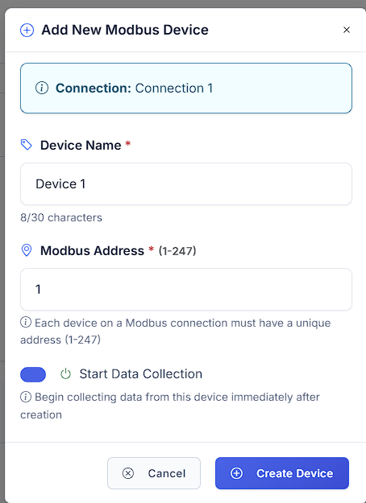
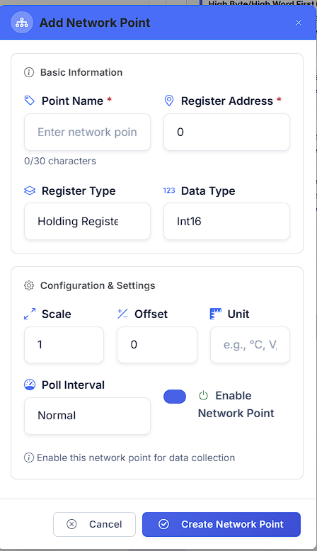

# Getting Started with SHModbus

## System Requirements

- **Operating System**: Windows 10/11, Linux
- **Browser**: Chrome, Firefox, Edge, Safari (latest versions)
- **Network**: Access to Modbus TCP/IP devices on local network

## Installation and Setup

### 1. Download Application
1. Download the latest SHModbus version from the official website [link for a download](https://sourceforge.net/projects/shmodbus/)
2. **Choose the correct installation file for your platform**:
   - **SHModbus-V1.0.0-linux-x64.deb**: For Linux systems (64-bit Intel/AMD processors) - Debian package
   - **SHModbus-V1.0.0-linux-arm64.deb**: For Linux systems (ARM 64-bit processors, like Raspberry Pi 4) - Debian package
   - **SHModbus-V1.0.0-win-x64.exe**: For Windows systems (64-bit Intel/AMD processors) - Executable installer
3. **Install the application**:
   - **Windows**: Run the `SHModbus-Vx.y.z-win-x64.exe` installer and follow the setup wizard
   - **Linux (GUI Method)**: Right-click the `.deb` file and select "Package Install"
   
   { .center }
   
   - **Linux (Terminal Method)**: Install the `.deb` package with `sudo dpkg -i SHModbus-V1.0.0-linux-*.deb`

### 2. First Launch

#### Windows Launch

1. **Double-click the SHModbus icon** on your desktop (not SHModbus Console)
{ .center }
2. **SHModbus Server Host will open** - you should see the main server interface:

{ .center }

3. **Open browser** and navigate to `http://localhost:5000`
4. **Check connection** - application should display the main interface
5. **Configure devices** - add your first Modbus device

**Note**: There are two applications available:
- **SHModbus**: Main web-based application (use this one)
- **SHModbus Console**: Command-line version for advanced users

**SHModbus Console (Alternative)**

{ .center }

**For Advanced Users**: If you prefer command-line interface:
- **Windows**: Double-click **SHModbus Console** icon on desktop
- Provides direct command-line access to Modbus operations
- Suitable for automation, scripting, or users who prefer terminal interfaces

#### Linux Launch

1. **Launch from Applications Menu**: 
   - Look for "SHModbus" in your applications menu/launcher
   - Or search for "SHModbus" in your system's application search
2. **Alternative - Launch from Terminal**: 
   - Open terminal and run: `shmodbus`
   - Or run: `/home/[user_name]/shmodbus`
3. **SHModbus will start** - you should see the console output:

{ .center }

4. **Open browser** and navigate to `http://localhost:5000`
5. **Check connection** - application should display the main interface
6. **Configure devices** - add your first Modbus device

**Note**: After installing the .deb package, SHModbus should be available system-wide and accessible from the applications menu.

### 3. Command-Line Arguments (Advanced)

Both **SHModbus** and **SHModbus Console** applications support command-line arguments for advanced configuration:

#### Available Arguments

**Port Configuration:**
- `--port 8080` or `--port=8080` - Set custom port (default: 5000)
- `--urls http://0.0.0.0:8080` or `--urls=http://0.0.0.0:8080` - Set custom URLs

#### Usage Examples

**Windows (Command Prompt/PowerShell):**
```cmd
# Launch with custom port
"C:\Program Files\SHModbus\SHModbus.exe" --port 8080

# Launch with specific URLs
"C:\Program Files\SHModbus\SHModbus.exe" --urls http://0.0.0.0:8080
```

**Linux (Terminal):**
```bash
# Launch with custom port
shmodbus --port 8080

# Launch with specific URLs
shmodbus --urls http://0.0.0.0:8080
```

#### Argument Priority

The application uses the following priority order for configuration:
1. **`--urls` argument** (highest priority)
2. **`--port` argument**
3. **`ASPNETCORE_URLS` environment variable**
4. **Default port 5000** (lowest priority)

#### Environment Variables

**Windows (PowerShell):**
```powershell
$env:ASPNETCORE_URLS="http://0.0.0.0:8080"
& "C:\Program Files\SHModbus\SHModbus.exe"
```

**Linux (Bash):**
```bash
export ASPNETCORE_URLS="http://0.0.0.0:8080"
shmodbus
```

**Note**: When using `--port` or `--urls` arguments, the application will be available on ALL network interfaces (0.0.0.0), making it accessible from other devices on your local network.

### Port Configuration

**Default Ports**:
- **Web Interface**: `http://localhost:5000` (default)
- **HTTP API**: `http://localhost:5000` (same as web interface)

**Configuration Methods**:

1. **GUI Configuration** (Server Host only):
   - In the Server Host interface, click **"Configure Ports"** (orange button)
   - Set your preferred port for the web interface
   - Restart the application for changes to take effect
   - Access the web interface at your configured port: `http://localhost:[YOUR_PORT]`

2. **Command-Line Arguments** (Both applications):
   - Use `--port` or `--urls` arguments when launching the application
   - See [Command-Line Arguments section](#3-command-line-arguments-advanced) above for detailed examples
   - This method provides more flexibility and network accessibility options

**Note**: If port 5000 is already in use, SHModbus will automatically suggest an alternative port during startup.

## Configuring Your First Device

### Access Web Interface and Login

Once SHModbus is running (either GUI or Console version), you need to access the web interface:

1. **Open your web browser** (Chrome, Firefox, Edge, or Safari)
2. **Navigate to the application**:
   - **Default URL**: `http://localhost:5000`
   - **Custom port**: `http://localhost:[YOUR_PORT]` (if you configured a different port)
   - **Network access**: `http://[YOUR_IP]:[PORT]` (if launched with `--port` or `--urls` arguments)

3. **SHModbus Login Page** will appear:

{ .center }

!!! info "Default Login Credentials"
    **Username:** `admin@admin`  
    **Password:** `admin`  
    
    These are the default credentials for first-time login. Make sure to change them after your initial setup for security purposes.

4. **Enter your credentials** and click **"Login"** button

5. **Successful login** will redirect you to the main SHModbus dashboard where you can start configuring devices

**Note**: If you cannot access the web interface, check that:
- SHModbus application is running (check console output or Server Host window)
- No firewall is blocking the port
- The correct port number is being used
- For network access, ensure the application was started with `--port` or `--urls` arguments

### Step 1: Add Connection

#### 1. Access Connection Management
1. **In your web browser**, navigate to the main SHModbus browser window after successful login
2. **In the left sidebar**, look for the **"Configuration"** section (gear icon)
3. **Expand "Configuration"** if it's not already open
4. **Click on "Add Connection"** in the sidebar menu
5. The Add Connection form will appear in the main content area

{ .center }

#### 2. Fill Connection Details

The "Add New Modbus Connection" dialog will open with the following fields:

**Required Fields:**
- **Connection Name** *(red asterisk indicates required)*: Enter a descriptive name (e.g., "Connection 1")
  - Character limit: 12/30 characters shown
- **IP Address** *(required)*: Enter the target device's IP address (e.g., `192.168.1.100`)
- **Port** *(required)*: Specify the Modbus port (default: `502`)

**Advanced Settings:**
- **Communication Timeout (ms)**: Maximum time to wait for device response (default: `5000` ms)
- **Failed Request Retries**: Number of automatic retry attempts when communication fails (default: `3`)
- **Connect Automatically**: Toggle switch to automatically connect when application starts (enabled by default)

**Form Actions:**
1. **Fill in all required fields** (marked with red asterisk *)
2. **Configure advanced settings** if needed (or keep defaults)
3. **Click "Create"** button to save the connection
4. **Click "Close"** to cancel without saving

#### 3. Create and Verify Connection
1. **Click "Create"** button to save your connection settings
2. **The dialog will close** and your connection will be added to the system
3. **Check the left sidebar** - your new connection should appear under "Configuration"
4. **Test the connection** by expanding it and monitoring the connection status

**Example Configuration:**
```
Connection Name: "Main Production Line"
IP Address: 192.168.1.50
Port: 502
Communication Timeout: 5000ms
Failed Request Retries: 3
Connect Automatically: Enabled
```

**Note**: After creation, your connection will be available in the Configuration tree where you can manage devices, registers, and monitor real-time data.

### Step 2: Add Device

#### 1. Access Device Management
1. **In the left sidebar**, locate your newly created connection (e.g., "Connection 1")
2. **Check the connection status** - you should see a green circle with "0" indicating the connection is active
3. **Expand your connection** by clicking the dropdown arrow next to it
4. **Click on "Add Device"** option that appears under your connection

{ .center }

#### 2. Fill Device Details

The "Add New Modbus Device" dialog will open with the following fields:

**Connection Information:**
- **Connection**: Shows which connection this device will be added to (e.g., "Connection 1")
  - This field is read-only and automatically populated

**Required Fields:**
- **Device Name** *(red asterisk indicates required)*: Enter a descriptive name (e.g., "Device 1")
  - Character limit: 8/30 characters shown
- **Modbus Address** *(required)*: Set the device identifier (range: 1-247)
  - Default value: `1`
  - Each device on a Modbus connection must have a unique address

**Optional Settings:**
- **Start Data Collection**: Toggle switch to begin collecting data immediately after device creation
  - When enabled: "Begin collecting data from this device immediately after creation"
  - Recommended to keep enabled for immediate monitoring

#### 3. Create Device
1. **Fill in the Device Name** (descriptive name for your device)
2. **Set the Modbus Address** (unique number 1-247 for this device)
3. **Configure Start Data Collection** (recommended: keep enabled)
4. **Click "Create Device"** button to save
5. **Click "Cancel"** to abort without saving

**Example Device Setup:**
```
Connection: Connection 1
Device Name: "Temperature Sensor"
Modbus Address: 1
Start Data Collection: Enabled
```

**Important Notes:**
- Each device must have a **unique Modbus Address** (1-247) within the same connection
- The **Start Data Collection** feature allows immediate data monitoring after device creation
- After creation, the device will appear under your connection in the Configuration tree

### Step 3: Add Network Points

#### 1. Access Network Points Configuration
1. **In the left sidebar**, locate your created device (e.g., "Device 1")
2. **Click on "Device 1"** to open the device configuration page
3. **You'll see "No Network Points Configured"** message in the main content area
4. **The system prompts**: "We don't have any network points configured yet. Add your first network point to start collecting data."

#### 2. Add Your First Network Point
1. **Click "Add First Point"** button (blue button with plus icon)
2. **Alternative**: Click **"Import CSV"** if you have existing point configurations to import

{ .center }

#### 3. Configure Network Point Details

The "Add Network Point" dialog will open with the following sections:

**Basic Information:**
- **Point Name** *(red asterisk indicates required)*: Enter a descriptive name (e.g., "Enter network point")
  - Character limit: 0/30 characters shown
- **Register Address** *(required)*: Starting register address (e.g., `0`)
- **Register Type**: Select from dropdown (default: "Holding Register")
- **Data Type**: Select data format (default: "Int16")

**Configuration & Settings:**
- **Scale**: Multiply raw value by this factor (default: `1`)
- **Offset**: Add this value to scaled result (default: `0`)
- **Unit**: Measurement unit (e.g., "°C, V" - temperature, voltage)
- **Poll Interval**: Data collection frequency (default: "Normal")
- **Enable Network Point**: Toggle switch to activate data collection
  - Help text: "Enable this network point for data collection"

**Form Actions:**
1. **Fill in Point Name** (descriptive identifier for your data point)
2. **Set Register Address** (consult your device's Modbus map)
3. **Select Register Type** (Holding Register, Input Register, etc.)
4. **Choose Data Type** (Int16, Float32, etc.)
5. **Configure scaling and units** if needed (optional)
6. **Ensure "Enable Network Point"** toggle is ON
7. **Click "Create Network Point"** to save
8. **Click "Cancel"** to abort without saving

#### 4. Create Network Point
1. **Fill in Point Name** (descriptive identifier for your data point)
2. **Set Register Address** (consult your device's Modbus map)
3. **Select Register Type** (Holding Register, Input Register, etc.)
4. **Choose Data Type** (Int16, Float32, etc.)
5. **Configure scaling and units** if needed (optional)
6. **Ensure "Enable Network Point"** toggle is ON
7. **Click "Create Network Point"** to save
8. **Click "Cancel"** to abort without saving

**Example Network Point Setup:**
```
Point Name: "Tank Temperature"
Register Address: 0
Register Type: Holding Register
Data Type: Int16
Scale: 0.1
Offset: 0
Unit: °C
Poll Interval: Normal
Enable Network Point: Yes
```

#### 5. Verify Data Collection
After creating your first network point:
1. **The dialog will close** and your point will be added to the device
2. **The point appears** in the device's network points list
3. **Data collection begins automatically** (if "Enable Network Point" was ON)
4. **Monitor real-time values** in the dashboard interface
5. **Check connection status** and data quality indicators

**Important Notes:**
- **Register addresses** must match your device's Modbus memory map (check device documentation)
- **Register Type** determines how data is accessed (read-only vs read/write)
- **Data Type** should match how your device stores the information
- **Scale and Offset** allow conversion to engineering units (e.g., raw ADC to temperature)
- **Poll Interval** affects how frequently data is updated
- **Enable toggle** allows you to temporarily disable points without deleting them

**Next Steps:**
- **Add more network points** to monitor additional parameters from the same device
- **Use different register types** for various data sources
- **Configure alarms and alerts** based on point values
- **Export point configurations** to CSV for backup or replication

### Step 4: Test Connection (Diagnostics)

#### 1. Access Diagnostics
1. **In the left sidebar**, locate the **"Diagnostics"** section (stethoscope icon)
2. **Expand "Diagnostics"** if it's not already open
3. **Click on "General"** to access connection testing tools
4. The diagnostics page will display connection status and testing options

#### 2. Connection Testing
Once in the Diagnostics > General section:
1. **View connection status** for all configured connections
2. **Check device connectivity** and communication health
3. **Monitor network point data flow** and quality
4. **Review error logs** and troubleshooting information

#### 3. Verify System Health
**Connection Status Indicators:**
- **Green indicators**: Active and healthy connections
- **Red indicators**: Failed or disconnected connections
- **Yellow indicators**: Warning states or intermittent issues

**Data Quality Checks:**
- **Real-time data updates**: Verify network points are collecting data
- **Communication timeouts**: Check for network issues
- **Register read/write success**: Confirm Modbus operations

#### 4. Troubleshooting
If connections show issues in Diagnostics:
1. **Check network connectivity** between SHModbus and devices
2. **Verify IP addresses and ports** in connection settings
3. **Confirm Modbus addresses** match device configuration
4. **Review timeout settings** for network conditions
5. **Check device documentation** for proper register mapping

**Common Issues:**
- **Connection timeout**: Network latency or device not responding
- **Invalid register address**: Address doesn't exist on device
- **Wrong data type**: Mismatch between configured and actual data format
- **Network unreachable**: IP routing or firewall issues

**Note**: The Diagnostics section provides comprehensive monitoring and troubleshooting tools for maintaining reliable Modbus communications.

## Basic Functions

### Real-Time Monitoring
- **Data Table**: Automatic refresh every 2 seconds
- **Real-Time Charts**: Trend visualization
- **Notifications**: Alarms for critical values

### Data Management
- **Export to CSV**: Save historical data
- **Filters**: Search for specific values
- **Sorting**: Organize data as needed

## Troubleshooting

### Connection Issues
- **Check IP address** of the device
- **Verify port** (standard 502)
- **Check system firewall**
- **Test ping** to the device

### Data Issues
- **Check register addresses** in device documentation
- **Verify data type** (Int16, Float32, etc.)
- **Check device Slave ID**

## Technical Support

- **Online Documentation**: [Full documentation](../index.md)
- **Forum**: User community
- **Email**: contact@iotskyhub.com
- **GitHub**: Bug reports and suggestions
---

**Need help?** Visit the [main documentation page](../index.md) or contact our support team.