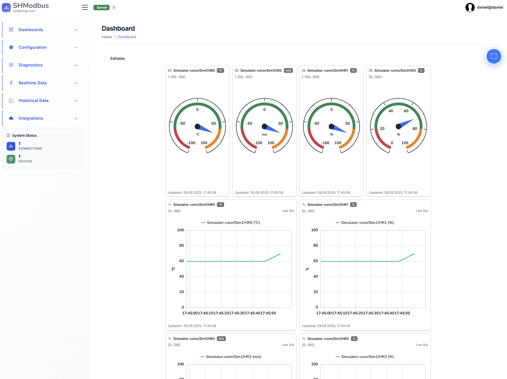

# SHModbus Client Application - User Guide

## Overview

SHModbus Client is a real-time industrial data monitoring and visualization application that connects to Modbus devices and displays live sensor data, equipment status, and system information through an intuitive web interface.

## Key Features

### Real-Time Data Monitoring
- **Live Data Table**: View real-time values from connected Modbus devices with automatic updates
- **Auto-refresh**: Data updates automatically every few seconds without manual refresh
- **Timestamp Display**: See exactly when each data point was last updated
- **Value Formatting**: All numeric values display with consistent 2-decimal precision

### Data Visualization
- **Interactive Charts**: Visual representation of data trends over time
- **Multiple Chart Types**: Line charts, bar charts, and other visualization options
- **Historical Data**: View past data trends and patterns
- **Zoom and Pan**: Interact with charts to focus on specific time periods

### Device Management
- **Connection Status**: Real-time indication of Modbus device connectivity
- **Device Information**: View details about connected equipment and sensors
- **Multiple Device Support**: Monitor multiple Modbus devices simultaneously
- **Connection Health**: Visual indicators show when devices are online/offline

### User Interface Features
- **Responsive Design**: Works on desktop computers, tablets, and mobile devices
- **Dark/Light Theme**: Choose your preferred visual theme
- **Sortable Tables**: Click column headers to sort data by any field
- **Search and Filter**: Find specific data points quickly
- **Export Capabilities**: Save data to files for external analysis

### Real-Time Communication
- **SignalR Integration**: Instant data updates without page refreshes
- **Live Notifications**: Immediate alerts when device status changes
- **Automatic Reconnection**: Maintains connection even during network interruptions
- **Low Latency**: Minimal delay between device updates and display

### Data Management
- **Cached Data**: Recent values stored locally for quick access
- **Data History**: Access to historical readings and trends
- **Value Validation**: Automatic detection and handling of invalid data
- **Time Zone Support**: Displays times in your local time zone

## Industrial Applications

- **Process Monitoring**: Track temperature, pressure, flow rates, and other process variables
- **Equipment Status**: Monitor motor speeds, valve positions, pump status
- **Alarm Monitoring**: Real-time alerts for out-of-range conditions
- **Quality Control**: Track production metrics and quality parameters
- **Energy Management**: Monitor power consumption and efficiency metrics

## Accessibility Features

- **Keyboard Navigation**: Full application control using keyboard only
- **Screen Reader Support**: Compatible with assistive technologies
- **High Contrast Options**: Enhanced visibility for users with visual impairments
- **Scalable Interface**: Adjustable text and element sizes

## Performance Optimization

- **Efficient Updates**: Only refreshes data that has actually changed
- **Bandwidth Optimization**: Minimal network usage for continuous monitoring
- **Browser Compatibility**: Works with all modern web browsers
- **Fast Loading**: Quick startup and responsive interface

## Configuration Options

- **Customizable Views**: Arrange data displays to match your workflow
- **User Preferences**: Save your preferred settings and layouts
- **Data Point Selection**: Choose which sensors and values to monitor
- **Update Intervals**: Adjust how frequently data refreshes

## Security Features

- **Secure Connections**: Encrypted communication with devices and servers
- **User Authentication**: Access control and user management
- **Data Integrity**: Verification that displayed data is accurate and unchanged
- **Audit Trail**: Logging of user actions and system events

## Common Use Cases

- **Manufacturing**: Monitor production line equipment and quality metrics
- **HVAC Systems**: Track temperature, humidity, and air quality
- **Water Treatment**: Monitor flow rates, chemical levels, and pump status
- **Energy Systems**: Track power generation, consumption, and efficiency
- **Building Automation**: Monitor lighting, security, and environmental systems
- **Laboratory Equipment**: Track test conditions and measurement results

## Getting Started

1. Open the application in your web browser
2. Wait for connection to establish with Modbus devices
3. View real-time data in the Live Table
4. Explore charts and visualizations for trends
5. Customize your view by sorting and filtering data
6. Set up alerts and monitoring for critical parameters

The application automatically handles all technical details of Modbus communication, data formatting, and real-time updates, allowing you to focus on monitoring your industrial processes and equipment.