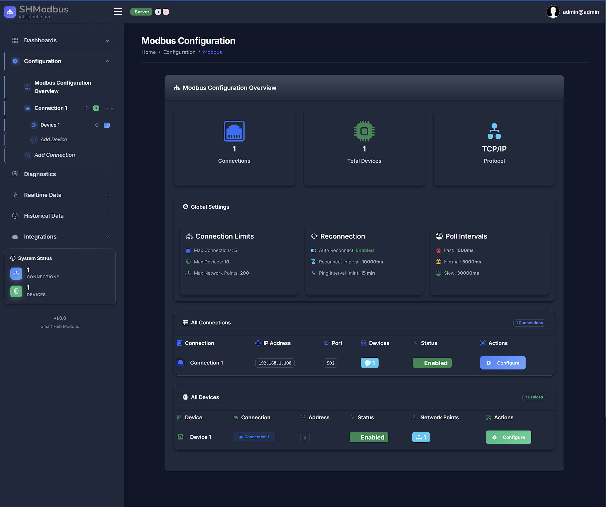

# SHModbus

## Choose Your Language / Wybierz Język / Sprache Wählen / Choisir la Langue

Welcome! Please select your preferred language for the documentation:

- [🇵🇱 **Polski** - Dokumentacja w języku polskim](pl/)
- [🇬🇧 **English** - Documentation in English](en/)  
- [🇩🇪 **Deutsch** - Dokumentation auf Deutsch](de/)
- [🇫🇷 **Français** - Documentation en français](fr/)

---

**SHModbus Client** is a real-time industrial data monitoring and visualization application that connects to Modbus devices and displays live sensor data through an intuitive web interface.